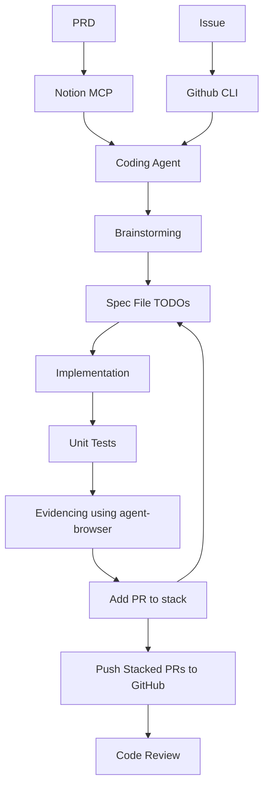

# Software Factory

My Attempt to build a software factory using fundamental components as much as possiible so that the setup is harness agnostic.

## Factory Lifecycle



## Tooling

- Runtimes - NodeJS, JDK, Miniconda
- PRD source - Notion via MCP
- Issue Tracker - GitHub Issues
- Version Control - Github via `gh` CLI + stack PR extension
- Harness - Tested with 
   - Codex CLI + DeepSeek
   -  Command Code
   -  Cursor


## Installation

### Quick Install All Agent Skills

Install every skill in this repo in one line — no clone required, same as the OpenCode / Claude Code installers:

```sh
curl -fsSL https://raw.githubusercontent.com/engineeringmadness/agent-skills/master/scripts/install-skills-global.sh | bash
```

**Windows** (CMD — download the batch script and run it; note that piping a script into `cmd` does NOT work, because `%~1`-style batch arguments and `if (...)` blocks only work in a real `.bat` file):

```bat
curl -fsSL -o "%TEMP%\install-skills-global.bat" https://raw.githubusercontent.com/engineeringmadness/agent-skills/master/scripts/install-skills-global.bat && call "%TEMP%\install-skills-global.bat"
```

### Install Specific Agent Skills

Install the whole plugin with any Agent Plugins-compatible client, or install individual skills:

```sh
# List all skills in the plugin
npx skills add https://github.com/engineeringmadness/agent-skills --list

# Install a specific skill
npx skills add https://github.com/engineeringmadness/agent-skills --skill name-of-skill
```

## Cloud Agent

Containerized the above setup with Codex + DeepSeek as the harness

### Build the image

```sh
docker build -t coding-agent .
```

### Create and run a container

Pass your API keys as environment variables and mount your project into `/workspace`:

```sh
docker run -d --name coding-agent -e DEEPSEEK_API_KEY=<key> -e GH_TOKEN=<token> -v "$(pwd):/workspace" coding-agent -c "tail -f /dev/null"
```

Attach to the running container when you want an interactive shell:

```sh
docker exec -it coding-agent bash
```